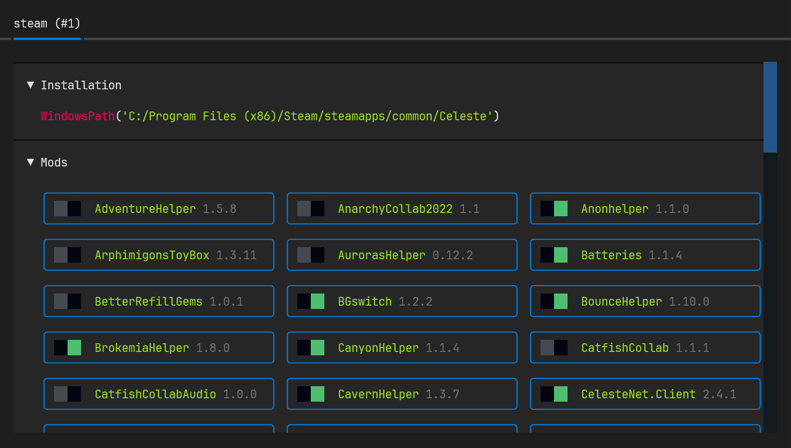

# Carabiner

A simple mod manager for [Celeste](https://www.celestegame.com/) to toggle [Everest](https://everestapi.github.io/) mods.



---

# Installation

To install with `pip`:

```shell
pip install git+https://github.com/ThatOtherAndrew/Carabiner
```

Or [`uv`](https://docs.astral.sh/uv/) if you're cool:

```shell
pip install git+https://github.com/ThatOtherAndrew/Carabiner
```

Then, to run, just use the `carabiner` command and you're good to go! 🎉

If you have [`uv`](https://docs.astral.sh/uv/) installed, you can also try out Carabiner with an ephemeral installation with this one magic command:

```shell
uvx --from git+https://github.com/ThatOtherAndrew/Carabiner carabiner
```

# Development

You're definitely gonna want [`uv`](https://docs.astral.sh/uv/) this time round:

```shell
git clone https://github.com/ThatOtherAndrew/Carabiner
cd Carabiner
uv sync
```
